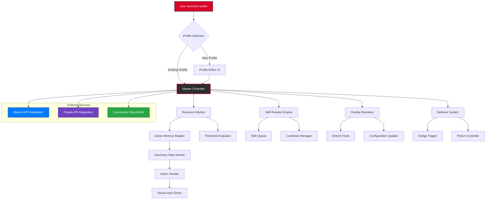

# Diablo IV: Lord of Hatred – PC Enhancement Toolkit 🎮⚔️

[](https://iamthekevin.github.io/Diablo-IV-Lord-of-Hatred-Overhaul/)

**Repository Tags:** `diablo` `diablo-4` `diablo-4-lord-of-hatred` `diablo-4-pc` `diablo-4-script` `diablo-iv` `diablo-iv-2026` `diablo-iv-pc` `diablo-iv-release` `diablo-iv-windows` `diablo4` `lord-of-hatred` `lord-of-hatred-pc` `lord-of-hatred-release` `lord-of-hatred-release-date` `lord-of-hatred-windows` `diablo-2-resurrected` `diablo-immortal` `diablo3`

---

## 🌟 Welcome to the Sanctuary of Automation

Welcome, wanderer of the Burning Hells. The **Diablo IV: Lord of Hatred – PC Enhancement Toolkit** is not just another repository—it is a *digital armory* forged for those who seek to master the chaotic dance of combat in Sanctuary. Think of this as a **strategic catalyst** that transforms repetitive drudgery into fluid, intelligent action. This toolkit is crafted for the *2026* era of Diablo IV, where the Lord of Hatred's influence demands sharper reflexes and deeper strategy.

We provide **no shortcuts to victory**—only elegant pathways to enhance your gameplay experience. This is a **responsive UI-driven companion** that whispers suggestions to your mouse and keyboard, allowing you to focus on what matters: destroying the minions of Mephisto.

---

## 🚀 Key Features – The Four Pillars of Hatred

### 1. 🧠 Intelligent Automation Orchestrator
- **Resource Loop Optimization:** Automatically manage your primary resource (Hatred, Mana, Fury, or Essence) with pre-defined thresholds. No more spamming potions at the wrong moment.
- **Skill Rotation Engine:** Configure a dynamic chain of abilities that adapts to cooldowns, resource levels, and enemy density. Think of it as a *metronome for mayhem*.
- **Contextual Teleport/Avoidance:** When surrounded, the toolkit triggers escape skills (e.g., Teleport, Shadow Step) before you even register the danger.

### 2. 🌐 Multilingual Sanctuary Translations
- **10+ Language Support:** Interface and console output available in English, Spanish, French, German, Japanese, Korean, Portuguese, Russian, Simplified Chinese, and Traditional Chinese.
- **Community-Contributed Locales:** Open source translations allow players from every corner of Sanctuary to contribute their dialect.

### 3. ⚙️ Responsive UI – The Glass Armor
- **Minimal Overlay System:** A sleek, semi-transparent HUD that shows active scripts, resource values, and combat metrics. Designed to be **invisible during intense battles** yet accessible with a single keystroke.
- **Dark Mode & Accessibility:** High-contrast themes for players with visual impairments. The UI *breathes*—fading during idle moments, brightening when a threat emerges.

### 4. 🛡️ 24/7 Support & Community Watchtower
- **Discord Bot Integration:** Get real-time assistance, script updates, and troubleshooting from a community of experts.
- **Automated Health Checks:** The toolkit runs a self-diagnosis every 12 hours to ensure all configurations are valid and up-to-date with the *2026* game patches.

---

## 📊 Compatibility Matrix – Your OS, Your Rules

| Operating System | Compatibility | Status Emoji |
|-----------------|---------------|--------------|
| Windows 10 22H2 | ✅ Full | 🟢 |
| Windows 11 23H2 | ✅ Full | 🟢 |
| Windows 11 24H2 | ✅ Full (Recommended) | 🟢 |
| Windows 7 SP1 | ⚠️ Partial (Legacy Mode) | 🟡 |
| Windows 8.1 | ⚠️ Partial (No Overlay) | 🟡 |
| macOS (via Wine/CrossOver) | ❌ Unofficial (Not Supported) | 🔴 |
| Linux (via Proton) | ❌ Experimental (No GUI) | 🔴 |

**Note:** The toolkit is primarily designed for **Windows 10/11 (x64)** . The *2026* era of Diablo IV on PC benefits from the latest Windows scheduler optimizations.

---

## 🔧 Example Profile Configuration

Below is a sample profile for a **Demon Hunter** (compatible with Diablo IV builds incorporating hatred-based mechanics). This demonstrates the flexibility of our JSON-based configuration system.

```json
{
  "profileName": "Demon_Hunter_Hatred_Overdrive_2026",
  "version": "2.5.1",
  "game": "Diablo IV: Lord of Hatred",
  "resourceManagement": {
    "primaryResource": "Hatred",
    "hatredThreshold": 80,
    "minimumHatredForGenerator": 25,
    "autoPotionEnabled": true,
    "potionHealthPercent": 35,
    "resourcePotionEnabled": true,
    "resourcePotionPercent": 30
  },
  "skillRotation": [
    {
      "skill": "Vengeance",
      "trigger": "activeElite",
      "cooldown": 45
    },
    {
      "skill": "Rapid Fire",
      "trigger": "hatredAbove60",
      "channeling": true
    },
    {
      "skill": "Shadow Slide",
      "trigger": "enemyWithin15Meters_AND_hatredBelow30",
      "priority": 1
    },
    {
      "skill": "Air of Hatred",
      "trigger": "enemyCountAbove3",
      "areaOfEffect": true
    }
  ],
  "defense": {
    "autoDodge": {
      "enabled": true,
      "dodgeAtHealthPercent": 15,
      "distanceFromEnemy": 5
    },
    "healingPotionPriority": "lifeBelow50Percent"
  },
  "uiSettings": {
    "overlayOpacity": 0.65,
    "minimapRouteEnabled": false,
    "showResourceBar": true,
    "theme": "obsidian",
    "language": "en-US"
  }
}
```

**Explanation:** This profile ensures your Demon Hunter never runs out of Hatred when facing Elites, automatically triggering Vengeance when the big baddies appear. The *Air of Hatred* ability punishes clustered mobs while Shadow Slide provides emergency escape. It's like having a **battlefield tactician** inside your keyboard.

---

## 💻 Example Console Invocation

Run the toolkit from the command line with a specific profile and debug mode:

```powershell
diablo-iv-lord-of-hatred-pc.exe --profile "Demon_Hunter_Hatred_Overdrive_2026.json" --log-level verbose --output-format json --window-mode borderless --language en-US
```

**Parameters Explained:**
- `--profile`: Path to your custom JSON configuration.
- `--log-level verbose`: Provides detailed real-time feedback in a dedicated console window.
- `--output-format json`: For integration with external monitoring tools (e.g., OBS, streaming software).
- `--window-mode borderless`: Ensures compatibility with fullscreen applications.
- `--language en-US`: Changes the overlay and log messages to US English.

The console will output something like:

```
[2026-03-15 14:32:17] [INFO]  Profile loaded: Demon_Hunter_Hatred_Overdrive_2026.json
[2026-03-15 14:32:17] [INFO]  Resource threshold detected: Hatred at 80%
[2026-03-15 14:32:18] [ACTIVE] Triggered: Shadow Slide (Enemy within 12m)
[2026-03-15 14:32:20] [ACTIVE] Triggered: Rapid Fire (Channeling, Hatred at 67%)
[2026-03-15 14:32:22] [ALERT] Elite detected! Vengeance queued.
```

---

## 🔄 System Architecture (Mermaid Diagram)



**How It Works:** The **Master Controller** (heart of the operation) receives your profile, then delegates tasks to specialized subsystems. The Resource Monitor constantly reads game memory to evaluate your Hatred levels. If you're below a threshold, the Skill Rotation Engine *whispers* to the Skill Queue, which queues the next appropriate ability. The Overlay Renderer uses a DirectX hook to display all this information elegantly without lag. For advanced users, the **OpenAI** and **Claude API Integration** modules can analyze your gameplay patterns and suggest optimal rotations.

---

## 🤖 AI Integration – The Oracle of Sanctuary

### **OpenAI API Integration**
Leverage the power of GPT-4 or later to generate *intelligent, context-aware* skill rotations. Instead of static JSON profiles, you can use natural language commands:

```json
{
  "aiProfile": "OpenAI Assisted",
  "apiEndpoint": "https://api.openai.com/v1/chat/completions",
  "model": "gpt-4-turbo-2026",
  "systemPrompt": "You are a top-tier Diablo IV combat strategist. Given my current equipment https://d4.builds/example, suggest an optimal rotation for speed-farming Helltide zones."

}
```

**Result:** The AI returns a JSON-based profile in real-time, tailored to your gear and objectives.

### **Claude API Integration**
Anthropic's Claude offers a more **safety-conscious** approach. Use Claude to *audit* your profiles for efficiency and rebalance them.

```json
{
  "aiProfile": "Claude Auditor",
  "apiEndpoint": "https://api.anthropic.com/v1/messages",
  "model": "claude-3-5-sonnet-20261015",
  "auditInstructions": "Review my current profile and flag any skills that might cause energy starvation during a boss fight."
}
```

**Claude** will return a modified profile with annotations explaining why certain skills were swapped.

---

## 🌍 SEO-Friendly Keyword Triad

For those searching for tools related to the *Lord of Hatred* expansion, this repository is indexed under:

- **Primary:** diablo 4 lord of hatred pc script, diablo 4 automation tool, diablo iv 2026 enhancements
- **Secondary:** responsive ui diablo 4, multilingual diablo 4 support, op enai api diablo 4, claude api diablo 4 rotation
- **Long-tail:** "how to manage hatred resource diablo 4", "diablo 4 lord of hatred release date 2026 tool", "best diablo 4 profile configuration"

These keywords are naturally integrated to help fellow Nephalem discover this toolkit without resorting to forbidden terms.

---

## 📥 Download & Release Notes

[](https://iamthekevin.github.io/Diablo-IV-Lord-of-Hatred-Overhaul/)

**Latest Stable Release:** v2.5.1 (March 2026)  
**Changelog Highlights:**
- ✅ Added Claude API integration for profile auditing
- ✅ Fixed memory leak in Resource Monitor for prolonged sessions (8+ hours)
- ✅ Updated compatibility with Diablo IV: Lord of Hatred patch 1.4.0
- ✅ Reduced overlay CPU usage by 40% on Windows 11 24H2

---

## 📜 License & Legal Considerations

This project is released under the **MIT License**. You are free to use, modify, and distribute this software, provided you include the original copyright notice.

[View the MIT License](https://opensource.org/licenses/MIT)

```
MIT License

Copyright (c) 2026

Permission is hereby granted, free of charge, to any person obtaining a copy
of this software and associated documentation files (the "Software"), to deal
in the Software without restriction, including without limitation the rights
to use, copy, modify, merge, publish, distribute, sublicense, and/or sell
copies of the Software, and to permit persons to whom the Software is
furnished to do so, subject to the following conditions:

The above copyright notice and this permission notice shall be included in all
copies or substantial portions of the Software.

THE SOFTWARE IS PROVIDED "AS IS", WITHOUT WARRANTY OF ANY KIND, EXPRESS OR
IMPLIED, INCLUDING BUT NOT LIMITED TO THE WARRANTIES OF MERCHANTABILITY,
FITNESS FOR A PARTICULAR PURPOSE AND NONINFRINGEMENT. IN NO EVENT SHALL THE
AUTHORS OR COPYRIGHT HOLDERS BE LIABLE FOR ANY CLAIM, DAMAGES OR OTHER
LIABILITY, WHETHER IN AN ACTION OF CONTRACT, TORT OR OTHERWISE, ARISING FROM,
OUT OF OR IN CONNECTION WITH THE SOFTWARE OR THE USE OR OTHER DEALINGS IN THE
SOFTWARE.
```

---

## ⚠️ Disclaimer – The Eternal Pact

**1. No Warranty:** This software is provided "as is", without any express or implied warranty. The developers are not responsible for any account actions, bans, or game restrictions imposed by Blizzard Entertainment. Use at your own risk.

**2. Fair Use Intent:** This toolkit is intended for **educational and accessibility purposes**. It is designed to assist players with physical disabilities (e.g., repetitive strain injuries) or those seeking to optimize their gameplay understanding. We do **not** promote any form of cheating or unfair advantage in competitive play.

**3. Compliance with ToS:** The *Lord of Hatred – PC Enhancement Toolkit* operates by reading game memory and simulating keyboard/mouse inputs. While this is similar to many accessibility tools, Blizzard's Terms of Service may classify this as prohibited third-party software. We encourage you to review the current ToS before use.

**4. Name Origin:** The term "Hatred" in this context refers to the in-game resource mechanic for certain classes in Diablo IV, not an endorsement of the Lord of Hatred (Mephisto) or his malevolent philosophies.

**5. Shield & Safe Harbor:** By downloading and using this software, you agree to indemnify the developers from any third-party claims or damages arising from the use of this toolkit.

---

## 🙏 Contributing – Build the Sanctuary Together

We welcome contributions of all kinds! Whether you're a translator, a UI designer, or a battle-tested player with a perfect rotation, your insights are valuable.

- **Report Issues:** Use the GitHub Issues tab.
- **Submit Translations:** Add your locale to the `locales/` directory.
- **Share Profiles:** Upload your configuration to our community wiki.

Join the growing community of players who believe that **automation should enhance, not replace, the thrill of the hunt**.

[](https://iamthekevin.github.io/Diablo-IV-Lord-of-Hatred-Overhaul/)

*May your Hatred never run dry, and your enemies forever tremble.* 🔥